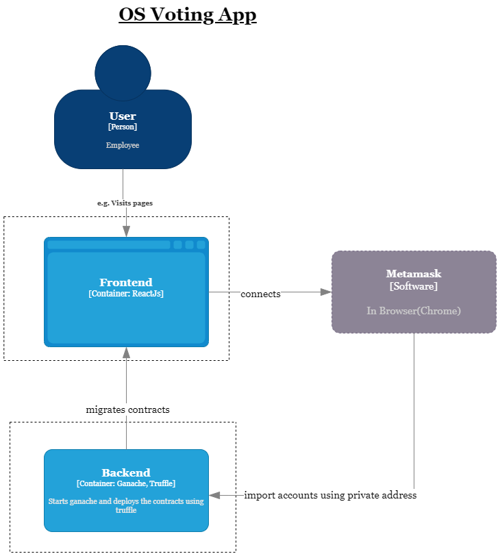

# Voting-App BlCh-Challenge-Task

## Description
### Use Case - OS Voting App 
Employees of a company have the choice between two operating systems. The "OS Voting App" enables employees to choose one of the OSs. \
When the vote is completed, the device will be ordered using ethereum (contracts). The voting system also shows which operating system received more votes so far.

## Visuals


## Approach
We used docker to make it easy to run the application. The following containers are created: 

**Frontend Container** - ReactJS Application: 

The application gets started using ``` npm start ```

**Backend** - ganache and truffle: 

Here truffle and ganache will be installed globally. After that ganache and truffle will be run using a bash script. We first start ``` ganache --host 0.0.0.0 ```. We use here host ``` 0.0.0.0 ``` because it is the default host for ganache in docker, then let it sleep for few seconds, to be able to migrate the contracts.

We tried to separate truffle and ganache in different containers, but ganache wasn't accessible from other containers, even if they were in the same network. To solve this issue, we put ganache and truffle in the same container and start them using a bash script.

## Installation

Metamask (https://metamask.io/download/)

Docker (https://docs.docker.com/get-docker/)

Docker-compose (https://docker-docs.netlify.app/compose/install/#master-builds)

## Usage and Run the application

### Run the application in docker

``` 
git clone https://gitlab.ost.ch/blch-challenge-task/voting-app-blch-challenge-task.git

cd voting-app-blch-challenge-task

docker-compose up

Copy one/more account/s using the private address from the private addresses list displayed in the terminal and import it/them to metamask.

Then open the app in browser(chrome): http://localhost:80

Request to connect to metamask using the button in the app: select one of the imported accounts

```

### Run the application without docker

``` 
git clone https://gitlab.ost.ch/blch-challenge-task/voting-app-blch-challenge-task.git

cd voting-app-blch-challenge-task

npm install -g truffle 
npm install -g ganache

ganache -p 7545   // start ganache

// In a different terminal

cd truffle
truffle migrate --network develop

Copy one/more account/s using the private address from the private addresses list displayed in the terminal and import it/them to metamask.

cd ..
npm start

Request to connect to metamask using the button in the app: select one of the imported accounts

```
